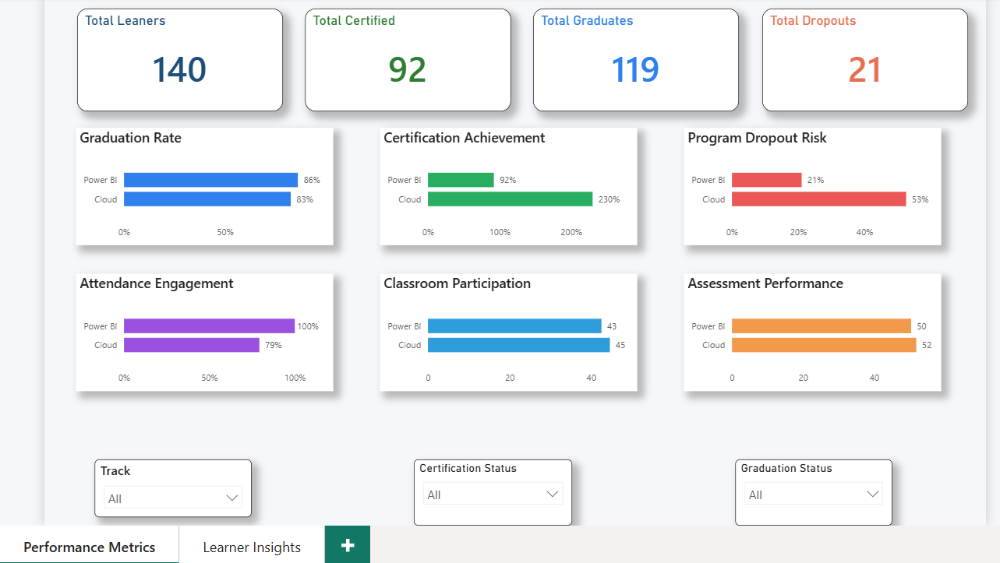
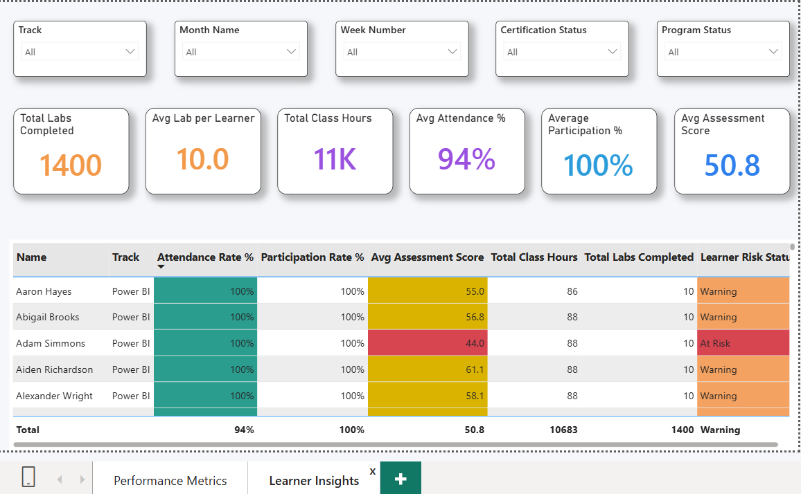

<div align="center">

# Dare Careers
## Student Progress & Performance Dashboard

*Enterprise Analytics Solution for Training Program Excellence*

[](https://powerbi.microsoft.com/)
[](https://www.microsoft.com/excel)
[]()

---

*Transforming raw operational data into actionable insights for data-driven program improvement*

[Overview](#project-overview) • [Objectives](#project-objectives) • [Data Sources](#data-sources--structure) • [Data Model](#data-modeling-approach) • [Analytics](#dax--analytical-logic) • [Dashboard](#dashboard-pages)

</div>

---

## Project Overview

The **Dare Careers Student Progress & Performance Dashboard** is an enterprise-style Power BI analytics solution designed to monitor learner engagement, academic performance, and program outcomes across training cohorts.

<div align="center">

### Training Programs Covered

</div>

<table>
<tr>
<td align="center" width="50%">

**Power BI**

*Data Visualization & Business Intelligence*

</td>
</tr>
</table>

This dashboard enables program managers and trainers to track learner progress throughout a **structured 10-week training program**, identify at-risk learners early, and evaluate program success through measurable performance indicators.

<div align="center">

### Data Transformation Flow

**Raw Operational Data** → *Structured Analytics* → **Actionable Insights**

</div>

The solution transforms raw operational data (attendance logs, participation records, assessments, and certification outcomes) into actionable insights through a structured data model and executive-level visual analytics.

---

## Project Objectives

The dashboard was built to:

<table>
<tr>
<td width="50%">

**Engagement Monitoring:**
- Monitor learner engagement and attendance trends
- Track academic performance across quizzes and labs
- Identify learners at risk of dropping out

</td>
<td width="50%">

**Outcome Measurement:**
- Measure certification and graduation outcomes
- Provide trainers with detailed learner-level insights
- Support data-driven program improvement decisions

</td>
</tr>
</table>

##  **Project Architecture**

```
 PowerBI_Dashboard_Tracking/
│
├──  data       
│  
│
├── images
|   
|   
├──  Dare Careers Stundent Tracking Dashboard.pbix
|    
|
├──  README.md
|    


```
---

## Data Sources & Structure

The data originated from two independent training tracks:

```
CloudTraining/
PowerBI Training/
```

Each track contains identical datasets.

---

### Zoom Attendance

<table>
<tr>
<th width="30%">Organization</th>
<th width="70%">Details</th>
</tr>
<tr>
<td><strong>Structure</strong></td>
<td>
• Organized into Week 1 – Week 10 folders<br>
• Daily attendance files exported from Zoom<br>
• Attendance derived using session duration
</td>
</tr>
</table>

**Key Columns:**

<table>
<tr>
<td width="50%">

- Name
- Email
- Join Time
- Leave Time

</td>
<td width="50%">

- Duration (minutes/time format)
- Role

</td>
</tr>
</table>

<div align="center">

### Business Rule

**A learner is marked `Attended` if session duration > 30 minutes**

</div>

---

###  Participation Records

Daily engagement records listing learners who actively participated.

**Structure:**

```
Date | Participants
```

Participants were stored as comma-separated learner names and transformed into normalized rows during data preparation.

---

###  Labs & Quizzes

Single Excel workbook containing:

<table>
<tr>
<td align="center" width="33%">

**Lab Scores**

Hands-on assessments

</td>
<td align="center" width="33%">

**Quiz Scores**

Knowledge validation

</td>
<td align="center" width="33%">

**Weekly Performance**

Week 1–10 tracking

</td>
</tr>
</table>

Data was reshaped into a **long format** for analytical modeling.

---

###  Learner Status

Program outcome dataset:

```
Email | Graduation Status | Certification Status
```

Used to calculate completion, certification, and dropout metrics.

---

## Data Modeling Approach

A **Star Schema** was implemented to ensure scalability and analytical performance.

<div align="center">

### Star Schema Architecture

```
         ┌─────────────────┐
         │  Dim_Learner    │
         │ ─────────────── │
         │ Email (PK)      │
         │ Track           │
         └────────┬────────┘
                  │
         ┌────────┴─────────────────────┐
         │                              │
         ▼                              ▼
┌─────────────────┐          ┌─────────────────┐
│   Dim_Date      │          │  Fact Tables:   │
│ ─────────────── │          │ ─────────────── │
│ Date (PK)       │◄─────────│ • Fact_Attendance
│ Day/Week/Month  │          │ • Fact_Participation
└─────────────────┘          │ • Fact_Assessments
                             │ • Fact_Learner_Status
                             └─────────────────┘
```

</div>

### Dimension Tables

<table>
<tr>
<th>Table</th>
<th>Key Attributes</th>
</tr>
<tr>
<td><strong>Dim_Learner</strong></td>
<td>
• Email (Primary Key)<br>
• Track (Cloud / Power BI)
</td>
</tr>
<tr>
<td><strong>Dim_Date</strong></td>
<td>
• Date hierarchy (Day, Week, Month)
</td>
</tr>
</table>

### Fact Tables

<table>
<tr>
<td width="50%">

- Fact_Attendance
- Fact_Participation

</td>
<td width="50%">

- Fact_Assessments
- Fact_Learner_Status

</td>
</tr>
</table>

This structure enables **dynamic filtering** and **accurate KPI calculations** across all visuals.

---

## Data Transformation (Power Query)

Key preparation steps included:

<table>
<tr>
<th width="50%">Transformation</th>
<th width="50%">Purpose</th>
</tr>
<tr>
<td>Combining multi-folder attendance files automatically</td>
<td>Unified data ingestion</td>
</tr>
<tr>
<td>Extracting class dates from filenames</td>
<td>Temporal context enrichment</td>
</tr>
<tr>
<td>Standardizing duration formats (minutes vs time)</td>
<td>Consistent measurement units</td>
</tr>
<tr>
<td>Splitting participation lists into individual learners</td>
<td>Normalized relational structure</td>
</tr>
<tr>
<td>Unpivoting weekly assessment columns</td>
<td>Long format for time-series analysis</td>
</tr>
<tr>
<td>Removing duplicates and enforcing email-based identity</td>
<td>Data quality assurance</td>
</tr>
<tr>
<td>Creating a master learner dimension</td>
<td>Centralized learner registry</td>
</tr>
</table>

---

## DAX & Analytical Logic

Custom DAX measures were created to calculate:

<table>
<tr>
<td width="50%">

**Engagement Metrics:**
- Attendance Rate %
- Participation Rate %
- Total Class Hours

</td>
<td width="50%">

**Performance Metrics:**
- Average Assessment Scores
- Labs Completion Metrics

</td>
</tr>
<tr>
<td colspan="2">

**Outcome Metrics:**
- Graduation Rate
- Certification Rate
- Dropout Rate

</td>
</tr>
</table>

Advanced filter handling techniques were applied to ensure slicers interacted correctly across all KPIs.

---

## Dashboard Pages

### Page 1 — Overall Performance Metrics



**Objective:** Provide an executive summary of program performance.

#### KPI Cards

<table>
<tr>
<td align="center" width="25%">

**Total Learners**

Program enrollment

</td>
<td align="center" width="25%">

**Total Certifications**

Certified graduates

</td>
<td align="center" width="25%">

**Total Graduations**

Successful completions

</td>
<td align="center" width="25%">

**Total Dropouts**

Attrition tracking

</td>
</tr>
</table>

---

#### Bar Chart Visuals

<table>
<tr>
<th>Category</th>
<th>Visualizations</th>
</tr>
<tr>
<td><strong>Program Outcomes</strong></td>
<td>
• Graduation Rate by Track<br>
• Certification Rate by Track<br>
• Dropout Rate by Track
</td>
</tr>
<tr>
<td><strong>Engagement Metrics</strong></td>
<td>
• Average Attendance %<br>
• Average Participation %<br>
• Average Assessment Score
</td>
</tr>
</table>

---

#### Interactive Filters

<table>
<tr>
<td width="50%">

- Track (Power BI / AWS Cloud)

</td>
<td width="50%">

- Certification Status
- Graduation Status

</td>
</tr>
</table>

<div align="center">

**Enables leadership to quickly evaluate program effectiveness**

</div>

---

### Page 2 — Detailed Learner Insights



**Objective:** Provide trainer-level visibility into individual learner performance.

#### Learner Table

<table>
<tr>
<th width="50%">Learner Information</th>
<th width="50%">Performance Metrics</th>
</tr>
<tr>
<td>
• Learner Name / Email<br>
• Track
</td>
<td>
• Attendance Performance<br>
• Participation Engagement<br>
• Assessment Scores<br>
• Program Outcomes
</td>
</tr>
</table>

---

#### KPI Cards

<table>
<tr>
<td width="50%">

**Assessment Metrics:**
- Total Labs Completed
- Average Labs per Learner

</td>
<td width="50%">

**Time Metrics:**
- Total Class Hours

</td>
</tr>
<tr>
<td colspan="2">

**Performance Indicators:**
- Average Attendance %
- Average Participation %
- Average Assessment Score

</td>
</tr>
</table>

---

#### Filters

<table>
<tr>
<td width="33%">

- Cohort
- Track
- Month

</td>
<td width="33%">

- Week
- Certification Status

</td>
<td width="33%">

- Program Status

</td>
</tr>
</table>

<div align="center">

**Supports early intervention and learner monitoring**

</div>

---

## Dashboard Design Principles

The dashboard follows senior BI UI standards:

<table>
<tr>
<td width="50%">

**Visual Design:**
- Semantic color system for metric categories
- Executive storytelling layout
- Consistent typography and spacing
- High-contrast KPI emphasis

</td>
<td width="50%">

**User Experience:**
- Minimal visual clutter
- Fully interactive slicer experience
- Intuitive navigation flow
- Professional presentation quality

</td>
</tr>
</table>

---

## Key Insights Enabled

The dashboard allows stakeholders to:

<table>
<tr>
<th>Stakeholder</th>
<th>Insights</th>
</tr>
<tr>
<td><strong>Program Managers</strong></td>
<td>
• Measure certification success rates<br>
• Evaluate training effectiveness over time<br>
• Compare performance across training tracks
</td>
</tr>
<tr>
<td><strong>Trainers & Instructors</strong></td>
<td>
• Detect engagement decline early<br>
• Monitor attendance consistency<br>
• Support early intervention for at-risk learners
</td>
</tr>
</table>

---

## Tools & Technologies

<div align="center">

<table>
<tr>
<th>Technology</th>
<th>Purpose</th>
</tr>
<tr>
<td><strong>Microsoft Power BI</strong></td>
<td>Primary analytics and visualization platform</td>
</tr>
<tr>
<td><strong>Power Query (ETL)</strong></td>
<td>Data extraction, transformation, and loading</td>
</tr>
<tr>
<td><strong>DAX (Data Analysis Expressions)</strong></td>
<td>Advanced calculations and measures</td>
</tr>
<tr>
<td><strong>Star Schema Data Modeling</strong></td>
<td>Optimized analytical data architecture</td>
</tr>
<tr>
<td><strong>Excel Data Sources</strong></td>
<td>Source data storage and integration</td>
</tr>
</table>

</div>

---

## Business Impact

This solution converts operational training data into a centralized analytics platform that:

<table>
<tr>
<td align="center" width="25%">

**Retention**

Improves learner retention monitoring

</td>
<td align="center" width="25%">

**Decision Support**

Supports instructor decision-making

</td>
<td align="center" width="25%">

**Evaluation**

Enables measurable program evaluation

</td>
<td align="center" width="25%">

**Reporting**

Provides leadership-ready reporting

</td>
</tr>
</table>

<div align="center">

### Impact Chain

**Early Detection** → **Timely Intervention** → **Improved Outcomes** → **Higher Success Rates**

</div>

---

## About the Author

<div align="center">

### Percy Ayimbila Nsolemna

*Data Analyst | Machine Learning Enthusiast | Cloud & BI Practitioner*

[](https://linkedin.com/in/yourprofile)
[](https://github.com/PercyAyimbilaNsolemna)
[](https://yourportfolio.com)
[](mailto:your.email@example.com)

**Specializations:** Business Intelligence • Data Analytics • Machine Learning • Cloud Computing

</div>

---

<div align="center">

## Project Recognition

**If this dashboard helped you understand Power BI analytics, consider starring the repository**

[](https://github.com/yourusername/dare-careers-dashboard)

---

*Built with precision for educational excellence*

**© 2025 Percy Ayimbila Nsolemna**

</div>